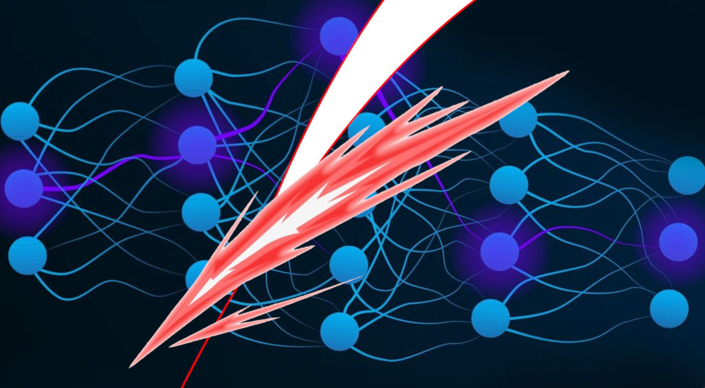

# Advent of Adversaries (Aperion 2025)



## What's in here?
### `imagenet-subset-224x224/`
- Contains a 100-image subset of ImageNet
- All images are PNGs.
- To match the input dimensions of the ResNet models provided (3 color channels x 224 x 224), all images have already been scaled and cropped to 224 x 224.
- The name of an image-file represents its respective class index in the output layer of the models.
- For example, the file `imagenet-subset-224x224/014.png` has the class index 14 and corresponds to the output logit `model(input)[0, 14]`.
- From the above, it should be obvious that each ImageNet class has atmost one image here.

### `index-to-label.json`
- A JSON file representing an array that maps a class index to its respective label
- For example, the file `imagenet-subset-224x224/014.png` has the class label "indigo bunting", since that is the string at index 14 of the JSON array.
- The labels for the images are not _strictly_ important to the problem statement, but they can be handy for debugging nonetheless.

### `models/`
- Contains three ResNet models, saved as PyTorch state dicts
- Example usage:
```python
import json
import torch
from torchvision import models
from torchvision.transforms import functional as TF

device = 'cuda' if torch.cuda.is_available() else 'cpu'

imagenet_mean = [0.485, 0.456, 0.406]
imagenet_std = [0.229, 0.224, 0.225]

with open('index-to-label.json') as file:
    index_to_label = json.load(file)

# Load a model
model = models.resnet18()
model.load_state_dict(torch.load('models/resnet18.pt'))
model.eval().to(device='cuda' if torch.cuda.is_available() else 'cpu')

# Load an image as a tensor
with Image.open('imagenet-subset-224x224/001.png') as img:
    img_tensor = TF.to_tensor(img).to(device=device)

# Normalize the image tensor
norm_img_tensor = TF.normalize(img_tensor, imagenet_mean, imagenet_std)

# BE CAREFUL THAT YOU USE THE NORMALIZED (NOT RAW) IMAGE WHEN PASSING IT TO THE MODEL!
pred = model(norm_img_tensor.unsqueeze(0))
print(index_to_label[pred.argmax().item()])
```
- __Do make sure to move the model (and loaded image tensors) to your device CUDA runtime if you have one!__

### `example-submission/`
- An example submission
- When submitting, zip your submission's parent directory, and submit that.

### `example.py`
- Script used to generate the example submission

### `evaluate.py`
- Script to evaluate submissions

### `requirements.txt`
- Run `pip install -r requirements.txt` to install the necessary packacges.